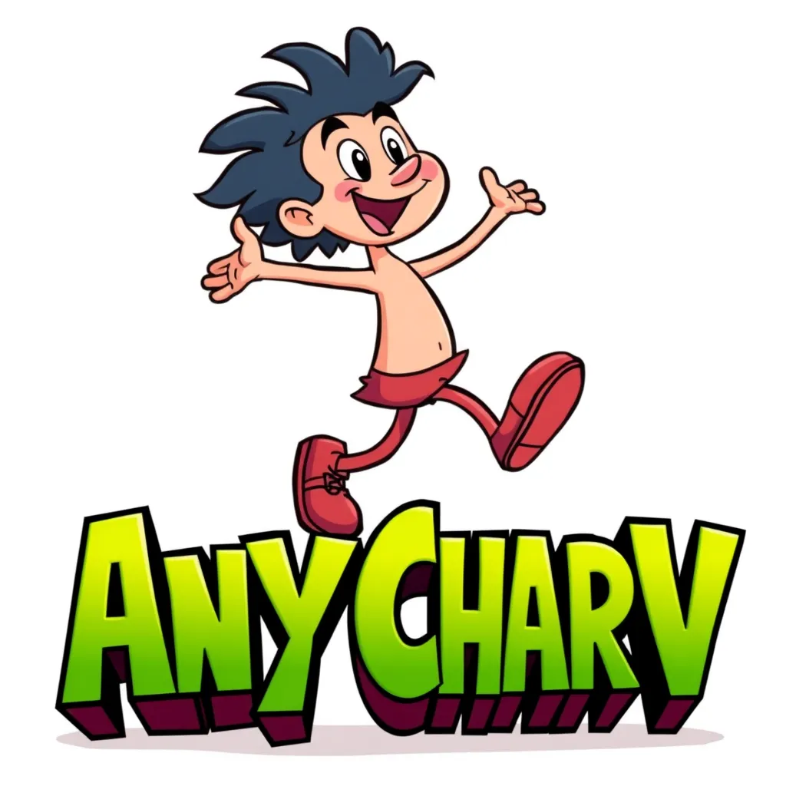
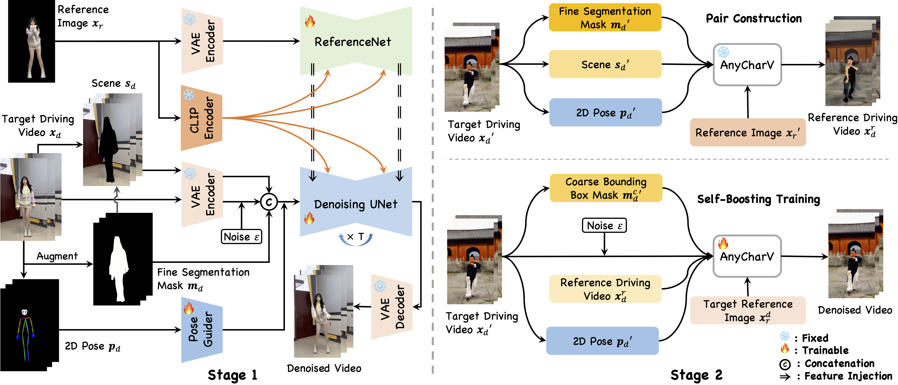

## ___***AnyCharV: Bootstrap Controllable Character Video Generation with Fine-to-Coarse Guidance***___

<div align="center">
</img>


 <a href='https://arxiv.org/abs/2502.08189'></a> &nbsp;
 <a href='https://anycharv.github.io'></a> &nbsp;
 <a href='https://huggingface.co/harriswen/AnyCharV'></a>

_[Zhao Wang](https://kyfafyd.wang/)\*, [Hao Wen](https://github.com/wenhao7841)\*, [Lingting Zhu](https://scholar.google.com/citations?user=TPD_P98AAAAJ), [Chengming Shang](), [Yujiu Yang](https://sites.google.com/view/iigroup-thu/about)†, [Qi Dou](https://www.cse.cuhk.edu.hk/~qdou)†_
<br><br>

</div>


## 📝 Changelog
- __[2025.02.18]__: 🔥 Inference code is released. Feel free to try it out!
- __[2025.02.17]__: 🔥 Pre-trained model released on huggingface.
- __[2025.02.13]__: Project page is built.


## Details

> Character video generation is a significant real-world application focused on producing high-quality videos featuring specific characters. Recent advancements have introduced various control signals to animate static characters, successfully enhancing control over the generation process. However, these methods often lack flexibility, limiting their applicability and making it challenging for users to synthesize a source character into a desired target scene. To address this issue, we propose a novel framework, ***AnyCharV***, that flexibly generates character videos using arbitrary source characters and target scenes, guided by pose information. Our approach involves a two-stage training process. In the first stage, we develop a base model capable of integrating the source character with the target scene using pose guidance. The second stage further bootstraps controllable generation through a self-boosting mechanism, where we use the generated video in the first stage and replace the fine mask with the coarse one, enabling training outcomes with better preservation of character details. Experimental results demonstrate the effectiveness and robustness of our proposed method.


<div align="center">
    <a href="https://"></a>
</div>

## 📦 Install

Please follow the instructions below to install the environment.

```bash
conda create -n anycharv python=3.10 -y
conda activate anycharv
pip install torch==2.3.1 torchvision xformers -i https://download.pytorch.org/whl/cu118/
pip install -r requirements.txt
pip install bezier==0.1.0 sam2==1.1.0 --no-deps
```

## 📥 Download weights

You can download the dwpose weights using the following command.

```bash
python scripts/download_weights.py
```

## 🚀 Inference

You can run the inference script with the following command and modify the `ref_image_path` and `tgt_video_path` to your own data. For the first time, it will download the [weights](https://huggingface.co/harriswen/AnyCharV). Finally, it will save the output to the `results` folder.

```bash
python scripts/pose2vid_anycharv_boost.py --ref_image_path ./data/ref_images/actorhq_A7S1.jpg --tgt_video_path ./data/tgt_videos/dance_indoor_1.mp4
```

## 🛡️ License

This project is under the Apache License 2.0 license. See [LICENSE](LICENSE) for details.

## 📝 Citation

If you find this code useful, please cite in your research papers.
```
@article{wang2025anycharv,
  title={AnyCharV: Bootstrap Controllable Character Video Generation with Fine-to-Coarse Guidance},
  author={Wang, Zhao and Wen, Hao and Zhu, Lingting and Shang, Chengming and Yang, Yujiu and Dou, Qi},
  journal={arXiv preprint arXiv:2502.08189},
  year={2025}
}
```
